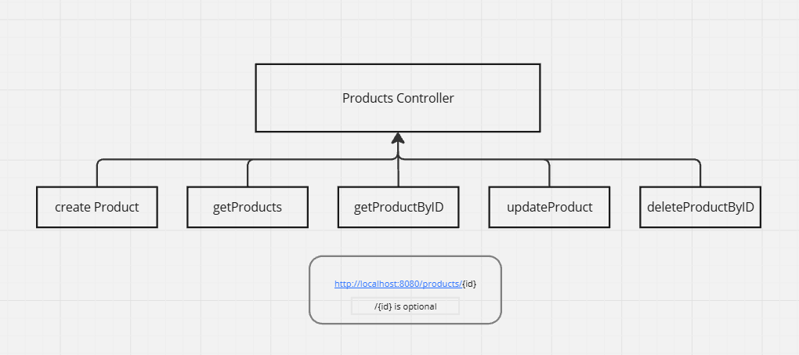

# Product CRUD Operation Project

This project is a simple Spring Boot application that demonstrates CRUD (Create, Read, Update, Delete) operations for managing products.





## Getting Started

### Prerequisites

- Java 11 or higher
- Maven 3.6.0 or higher
- An IDE (e.g., IntelliJ IDEA, Eclipse)

### Setting Up the Project

1. Clone the repository:
    ```sh
    git clone <repository-url>
    ```
2. Navigate to the project directory:
    ```sh
    cd simpleSpringBoot
    ```
3. Build the project using Maven:
    ```sh
    mvn clean install
    ```

### Running the Application

1. Run the Spring Boot application:
    ```sh
    mvn spring-boot:run
    ```
2. The application will start on `http://localhost:8080`.

### API Endpoints

- `POST /products` - Create a new product
- `GET /products` - Retrieve all products
- `GET /products/{id}` - Retrieve a product by ID
- `PUT /products/{id}` - Update a product by ID
- `DELETE /products/{id}` - Delete a product by ID

## Future Enhancements

- Add user authentication and authorization
- Implement pagination for product listing
- Add unit and integration tests
